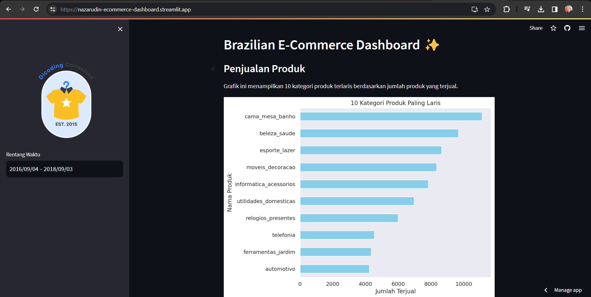
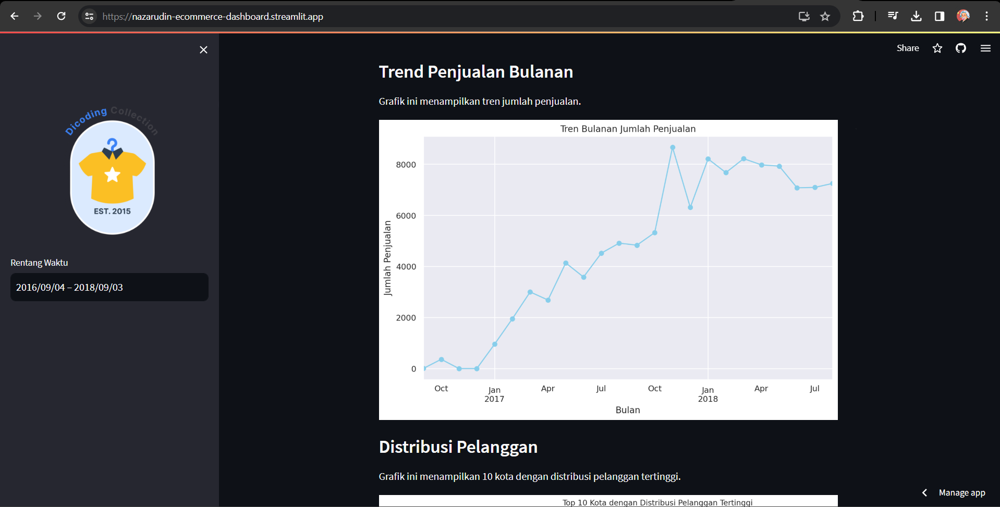
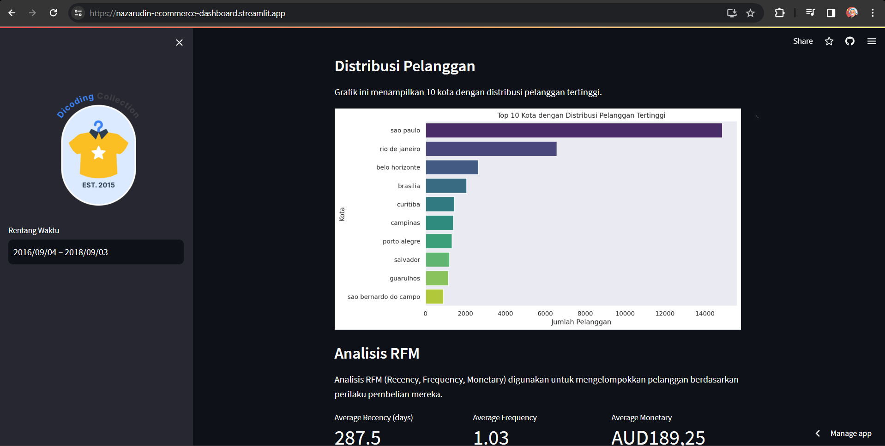

# Proyek Analisis Data

Repository Proyek Analisis Data ini adalah hasil pembelajaran saya pada kelas dicoding. Saya telah mempelajari berbagai topik mengenai proses analisis data seperti berikut:

* Dasar-Dasar Analisis Data
* Penerapan Dasar-Dasar Descriptive Statistics
* Petimbangan dalam Pengolahan Data
* Data Wrangling
* Exploratory Data Analysis
* Data Visualization
* Pengembangan Dashboard

# Brazilian E-Commerce Dashboard ✨

## Setup environment

```
conda create --name main-ds python=3.11.3
conda activate main-ds
pip install numpy pandas matplotlib seaborn streamlit babel
```

## Run streamlit app

```
streamlit run dashboard.py
```

https://nazarudin-ecommerce-dashboard.streamlit.app/




